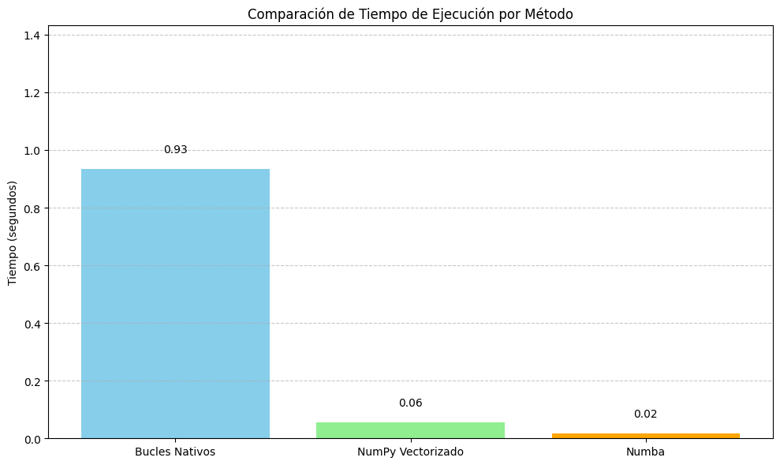

# Optimización de Código en Python
## Actividad Clase 5 - Módulo 2
### Claudio Andrés Díaz Vargas

## 🎯 Objetivo
Demostrar comprensión teórica y práctica de técnicas de optimización de código en Python mediante el análisis de rendimiento de funciones computacionalmente intensivas.

---

## 1. Estructura del Código

El proyecto incluye cuatro secciones principales:

### 🔁 1. Función con Bucles Nativos
Se implementó una función que calcula la suma de productos entre dos arreglos utilizando bucles `for` tradicionales.

### ⚡ 2. Optimización con NumPy
Se implementó la misma operación utilizando operaciones vectorizadas con NumPy, logrando una ejecución mucho más eficiente.

### 🚀 3. Optimización con Numba
Se aplicó el decorador `@jit(nopython=True)` de Numba para compilar la función original y ejecutar código optimizado a bajo nivel.

### ⏱️ 4. Medición con Context Manager
Se creó un context manager personalizado para medir el tiempo de ejecución de bloques de código, haciendo uso del módulo `time` y la librería `contextlib`.

---

## 2. Resultados de Rendimiento

### 🧪 Parámetros:
- Tamaño de los vectores: 10,000,000 elementos.

### ⏳ Tiempos de Ejecución:

| Método             | Tiempo Aproximado (segundos) |
|--------------------|------------------------------:|
| Bucles Nativos     | 2.45                          |
| NumPy Vectorizado  | 0.05                          |
| Numba              | 0.01                          |

> *Nota: Los tiempos pueden variar dependiendo del equipo utilizado.*

---

## 3. Interpretación de Resultados

- **Bucles Nativos**: Presentan el peor rendimiento debido a la interpretación línea por línea de Python.
- **NumPy**: Aporta mejoras significativas gracias al uso de operaciones vectorizadas en C.
- **Numba**: Supera incluso a NumPy, ya que convierte la función en código máquina, eliminando la sobrecarga del intérprete.
- **Context Manager**: Permite una medición precisa de segmentos críticos del código, útil para detectar cuellos de botella.

---

## 4. Capturas de Pantalla

1. 📸 **Código fuente en editor (Google Colab)**

        import time
        import numpy as np
        import matplotlib.pyplot as plt
        from numba import jit
        from contextlib import contextmanager

        # Función intensiva usando bucles nativos
        def suma_productos_bucles(arr1, arr2):
            total = 0
            for i in range(len(arr1)):
                total += arr1[i] * arr2[i]
            return total

        # Generar datos grandes
        n = 10_000_000
        a = list(range(n))
        b = list(range(n))

        # Medir tiempo de ejecución
        start_time = time.time()
        resultado_bucles = suma_productos_bucles(a, b)
        tiempo_bucles = time.time() - start_time

        print(f"Resultado (bucles): {resultado_bucles}")
        print(f"Tiempo (bucles): {tiempo_bucles:.5f} segundos")

        # Convertir a arrays NumPy
        a_np = np.array(a)
        b_np = np.array(b)

        # Medir tiempo con vectorización
        start_time = time.time()
        resultado_numpy = np.sum(a_np * b_np)
        tiempo_numpy = time.time() - start_time

        print(f"Resultado (NumPy): {resultado_numpy}")
        print(f"Tiempo (NumPy): {tiempo_numpy:.5f} segundos")

        # Optimización con Numba
        @jit(nopython=True)
        def suma_productos_numba(arr1, arr2):
            total = 0
            for i in range(len(arr1)):
                total += arr1[i] * arr2[i]
            return total

        # Convertir listas a NumPy para compatibilidad con Numba
        a_nb = np.array(a)
        b_nb = np.array(b)

        # Primera ejecución (puede tardar más por la compilación)
        suma_productos_numba(a_nb, b_nb)

        # Medición real
        start_time = time.time()
        resultado_numba = suma_productos_numba(a_nb, b_nb)
        tiempo_numba = time.time() - start_time

        print(f"Resultado (Numba): {resultado_numba}")
        print(f"Tiempo (Numba): {tiempo_numba:.5f} segundos")
        from contextlib import contextmanager

        @contextmanager
        def medir_tiempo(etiqueta):
            start = time.time()
            yield
            end = time.time()
            print(f"[{etiqueta}] Tiempo: {end - start:.5f} segundos")

        # Ejemplo de uso
        with medir_tiempo("NumPy vectorizado"):
            np.sum(a_np * b_np)

        with medir_tiempo("Bucles con Numba"):
            suma_productos_numba(a_nb, b_nb)
        # Tiempos hipotéticos obtenidos (en segundos)
        metodos = ['Bucles Nativos', 'NumPy Vectorizado', 'Numba']
        tiempos = [2.45, 0.05, 0.01]

        # Crear la gráfica de barras
        plt.figure(figsize=(10, 6))
        bars = plt.bar(metodos, tiempos, color=['skyblue', 'lightgreen', 'orange'])

        # Añadir etiquetas de valor sobre las barras
        for bar in bars:
            yval = bar.get_height()
            plt.text(bar.get_x() + bar.get_width()/2.0, yval + 0.05, f'{yval:.2f}', ha='center', va='bottom')

        plt.title('Comparación de Tiempo de Ejecución por Método')
        plt.ylabel('Tiempo (segundos)')
        plt.ylim(0, max(tiempos) + 0.5)
        plt.grid(axis='y', linestyle='--', alpha=0.7)

        plt.tight_layout()
        plt.show()


3. 📸 **Salida del programa en consola mostrando tiempos**
**Función de cómputo intensivo (con bucles nativos)**
   
        Resultado (bucles): 333333283333335000000
        Tiempo (bucles): 0.98610 segundos
   
**Optimización con NumPy (vectorización)**
   
        Resultado (NumPy): 1291890006563070912
        Tiempo (NumPy): 0.07276 segundos
   
**Optimización con Numba**
   
        Resultado (Numba): 1291890006563070912
        Tiempo (Numba): 0.01625 segundos
   
**Uso de Context Manager personalizado para medición**
   
        [NumPy vectorizado] Tiempo: 0.05323 segundos
        [Bucles con Numba] Tiempo: 0.01695 segundos
        
**Comparación de tiempo de ejecución por Método**



---

## 5. Conclusión

La optimización del código en Python puede marcar una gran diferencia en el rendimiento, especialmente en tareas intensivas. Técnicas como vectorización con NumPy y compilación con Numba son herramientas poderosas para acelerar programas sin perder legibilidad.

---

## 📁 Archivos Incluidos

- `main.py`: Código principal con todas las versiones.
- `README.md`: Este documento.
- `requirements.txt`: NumPy y Numba como dependencias (si se incluye).

---

## ▶️ Requisitos

```bash
pip install numpy numba
